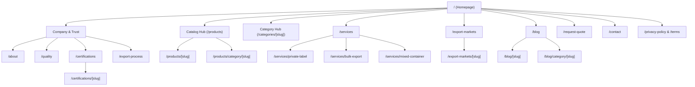

# 01. Sitemap & Information Architecture (IA)

## Executive Summary
Sheesh Exports is architected as an SEO-first, content-driven B2B international export platform for Indian spices, agro-commodities, grains, oil seeds, and allied food products. The IA is designed around high-intent commercial buyers (importers, distributors, food processors, retail chains) and structured to preserve clear topical hierarchy, crawl efficiency, and conversion pathways.

---

## 1. Core Information Architecture Hierarchy



---

## 2. Complete URL Directory & Route Inventory

| Route | Page Type | Primary Purpose & Content | Internal Linking & Funnel |
| :--- | :--- | :--- | :--- |
| `/` | Homepage | Brand authority, credentials, featured products, export markets, trust signals | Links to `/products`, `/export-markets`, `/certifications`, `/request-quote` |
| `/about` | Corporate | Company history, infrastructure, processing units, leadership, vision | Links to `/quality`, `/certifications`, `/contact` |
| `/quality` | Technical / Trust | QA laboratories, testing parameters, moisture/pesticide limits, hygienic packing | Links to `/certifications`, `/products`, `/request-quote` |
| `/certifications` | Compliance Hub | APEDA, Spices Board, FSSAI, ISO 22000, HACCP, Halal, Kosher, FDA compliance | Links to individual certification pages & product pages |
| `/certifications/[slug]` | Compliance Detail | In-depth breakdown of standard compliance per regulatory authority | Links to eligible products & `/request-quote` |
| `/export-process` | Operational | Step-by-step export workflow: Sourcing → Cleaning → Lab Testing → Custom Packaging → Container Loading → Port Clearance | Links to `/services/mixed-container`, `/request-quote` |
| `/products` | Catalog Directory | Searchable/filterable index of Indian spices, oil seeds, pulses, and commodities | Links to all individual product detail pages |
| `/products/[slug]` | Product Detail (PDP) | Comprehensive B2B product specifications, grades, origin, packaging, MOQ, HS codes, lab parameters, FAQs, RFQ trigger | Links to parent category, related products, related guides, `/request-quote` |
| `/products/category/[slug]` | Product Sub-Catalog | Filtered view by specific sub-class | Links to `/products/[slug]` |
| `/categories/[slug]` | Category Hub | High-level commercial landing page (Spices, Pulses, Grains, Oilseeds) with SEO overview | Links to all child products in category and `/request-quote` |
| `/services` | Services Hub | Comprehensive export facilitation services | Links to specific service offerings |
| `/services/private-label` | Service Landing | OEM packaging, custom branding, pouch/jar/tin packing, barcode & regulatory labeling | Links to `/products`, `/request-quote` |
| `/services/bulk-export` | Service Landing | FCL/LCL bulk shipments, 25kg/50kg PP/Jute bags, container desiccant solutions | Links to `/products`, `/request-quote` |
| `/services/mixed-container` | Service Landing | Consolidation of multi-commodity cargo in 20ft/40ft containers for international buyers | Links to `/products`, `/request-quote` |
| `/export-markets` | Geotargeting Hub | Overview of global shipping corridors and regulatory familiarity | Links to country-specific market pages |
| `/export-markets/[slug]` | Market Landing | Country-specific export intelligence (e.g. UAE, Saudi Arabia, USA, UK, Germany) covering import duties, compliant grades, shipping transit times | Links to in-demand products for that destination & `/request-quote` |
| `/blog` | Insights Hub | Educational guides, market pricing updates, crop reports, import-export regulatory walkthroughs | Links to articles & categories |
| `/blog/[slug]` | Educational Article | Long-form guide answering buyer queries (e.g., "How to import Indian chilli to the Gulf") | Links directly to relevant `/products/[slug]` & `/request-quote` |
| `/blog/category/[slug]` | Topical Archive | Category archive of market insights | Links to articles |
| `/request-quote` | Core Conversion | Multi-step B2B RFQ form capturing product specs, volume, incoterms, packaging & destination port | Target of all contextual CTAs |
| `/contact` | Communication | Headquarters address, phone, email, WhatsApp direct line, map, and general enquiry | Standard communication endpoint |
| `/privacy-policy` | Compliance | Data protection & privacy practices | Footer link |
| `/terms` | Legal | Commercial terms of service & disclaimers | Footer link |

---

## 3. SEO Internal Linking Flow

```
[Search Engine Searcher]
       │
       ▼
[Informational Query] ────────► [Blog Article: /blog/how-to-import-spices-from-india]
                                              │
                                              ▼ (Contextual product recommendation)
                                [Product Detail: /products/turmeric-finger]
                                              │
                                              ├────────► [Compliance: /certifications/halal]
                                              ├────────► [Market: /export-markets/uae]
                                              ▼
                                [Commercial RFQ: /request-quote]
```
