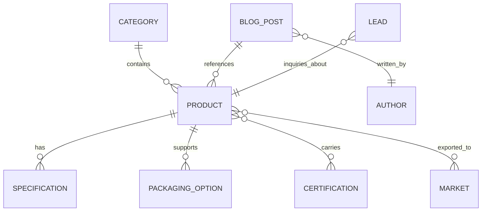

# 04. CMS & Entity Data Model

## Overview
Sheesh Exports is structured as a decoupled content model. Content definitions are completely independent of presentation components. Whether backed by headless Sanity, Payload CMS, or static JSON schemas during development, all data conforms to strict TypeScript interfaces.

---

## 1. Core Entity Relationship Diagram



---

## 2. Entity Schemas

### 1. `Product`
The central B2B data structure containing commercial, technical, and regulatory details.

```typescript
interface Product {
  id: string;
  name: string;
  slug: string;
  botanicalName?: string;
  hsCode: string;
  category: CategoryReference;
  shortDescription: string;
  description: string;
  origin: string; // e.g., "Guntur, Andhra Pradesh, India"
  harvestSeason?: string;
  images: {
    url: string;
    alt: string;
    isFeatured: boolean;
  }[];
  specifications: {
    label: string; // e.g. "Moisture", "ASTA Color", "SHU Heat", "Purity"
    value: string; // e.g. "Max 10%", "50 - 70 ASTA", "20,000 - 25,000 SHU"
  }[];
  grades: {
    gradeName: string; // e.g. "Stemless", "With Stem", "Crushed / Flakes", "Powder"
    description: string;
  }[];
  packaging: {
    type: string; // e.g., "Jute Bags", "PP Bags", "Vacuum Packs", "Carton Boxes"
    sizes: string[]; // e.g. ["10 kg", "25 kg", "50 kg"]
  }[];
  minimumOrderQuantity: string; // e.g. "1 x 20ft FCL (14 MT)"
  shelfLife: string; // e.g. "24 Months"
  applications: string[]; // e.g. ["Food Seasoning", "Oleoresin Extraction", "Retail Condiments"]
  availableMarkets: string[]; // Slugs of countries exported to
  certifications: string[]; // Slugs of certifications (APEDA, FSSAI, ISO, Halal)
  faqs: {
    question: string;
    answer: string;
  }[];
  featured: boolean;
  status: "draft" | "published" | "archived";
  seo: SEOData;
}
```

### 2. `Category`
```typescript
interface Category {
  id: string;
  name: string;
  slug: string;
  description: string;
  image: string;
  featured: boolean;
  seo: SEOData;
}
```

### 3. `ExportMarket`
```typescript
interface ExportMarket {
  id: string;
  country: string;
  slug: string;
  region: "Middle East" | "Europe" | "North America" | "Asia Pacific" | "Africa";
  flagIcon: string;
  heroImage: string;
  overview: string;
  keyImportRequirements: string[];
  topExportedProducts: string[]; // Product slugs
  majorPortsServed: string[];
  transitTimeEstimate: string; // e.g., "3 - 5 Days to Jebel Ali"
  seo: SEOData;
}
```

### 4. `Certification`
```typescript
interface Certification {
  id: string;
  name: string; // e.g. "APEDA Registration"
  slug: string;
  issuingBody: string;
  badgeImage: string;
  certificateNumber?: string;
  validity?: string;
  description: string;
  complianceDetails: string;
  featured: boolean;
  seo: SEOData;
}
```

### 5. `BlogPost`
```typescript
interface BlogPost {
  id: string;
  title: string;
  slug: string;
  excerpt: string;
  content: string;
  publishedAt: string;
  author: {
    name: string;
    role: string;
    avatar: string;
  };
  category: string;
  featuredImage: {
    url: string;
    alt: string;
  };
  relatedProducts: string[]; // Slugs of products
  seo: SEOData;
}
```

### 6. `Lead` (B2B Request for Quote)
```typescript
interface LeadQuote {
  id?: string;
  fullName: string;
  companyName: string;
  businessEmail: string;
  phone: string;
  country: string;
  productSlug: string;
  productGrade?: string;
  quantity: number;
  unit: "MT" | "KG" | "Containers (FCL)";
  packagingPreference: string;
  destinationPort: string;
  incoterm: "FOB" | "CIF" | "CFR" | "EXW";
  targetDeliveryDate?: string;
  message?: string;
  status: "new" | "contacted" | "quoted" | "closed";
  createdAt: string;
}
```
